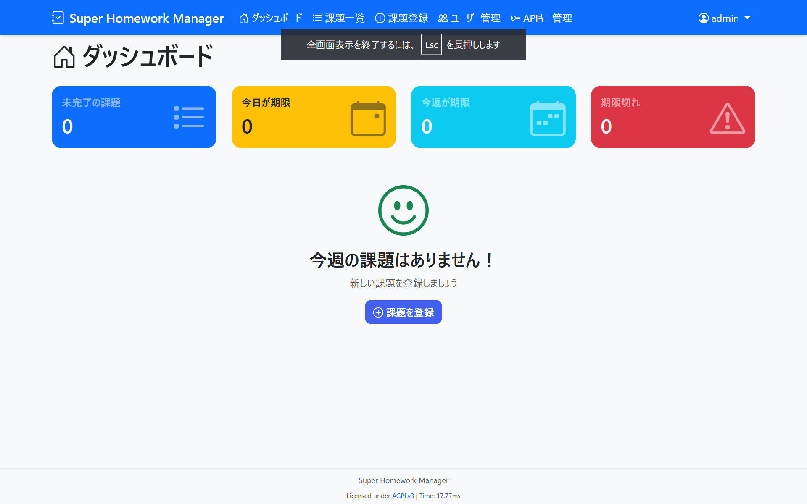
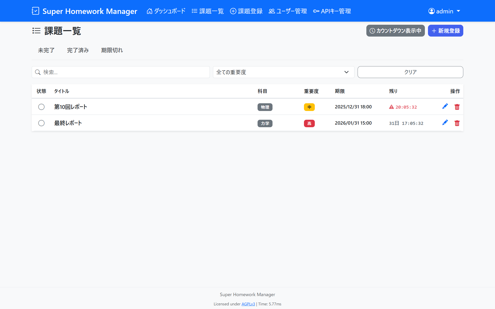
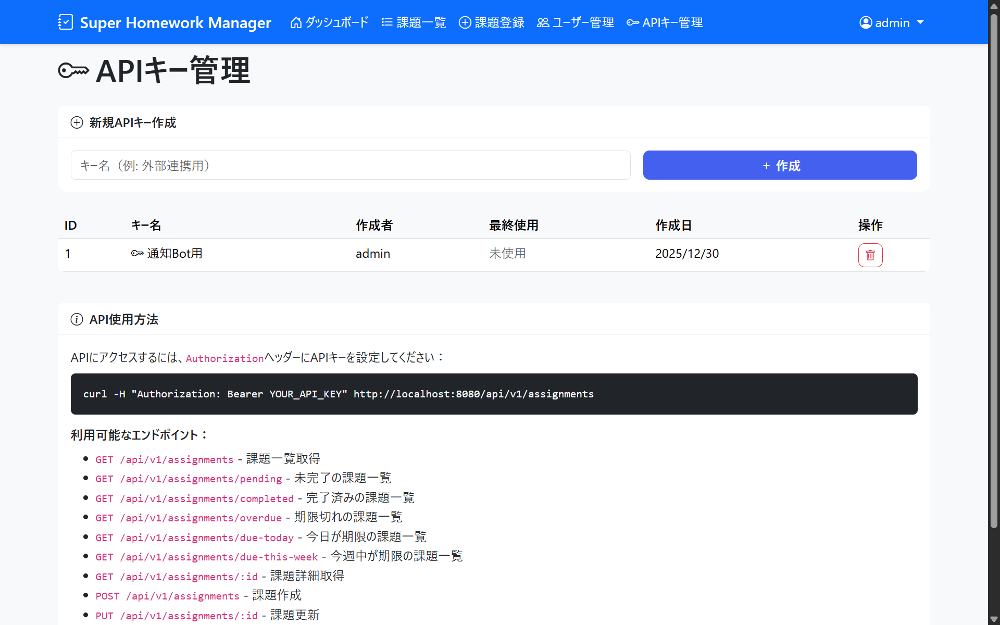

# Homework Manager

シンプルな課題管理アプリケーションです。学生の課題管理を効率化するために設計されています。

## 特徴

- **課題管理**: 課題の登録、編集、削除、完了状況の管理
- **繰り返し課題**: 日次・週次・月次の繰り返し課題を自動生成・管理
- **ダッシュボード**: 期限切れ、本日期限、今週期限の課題をひと目で確認
- **API対応**: 外部連携用のRESTful API (APIキー認証)
- **セキュリティ**:
  - CSRF対策
  - レート制限 (Rate Limiting)
  - セキュアなセッション管理
- **ポータビリティ**: Pure Go SQLiteドライバー使用により、CGO不要でどこでも動作






## TODO

- 取り組み目安時間の登録
- SNS連携（もしかしたらやるかも）

## ドキュメント

詳細な仕様やAPIドキュメントは `docs/` ディレクトリを参照してください。

- [仕様書](docs/SPECIFICATION.md): 機能詳細、データモデル、設定項目
- [APIドキュメント](docs/API.md): APIのエンドポイント、リクエスト/レスポンス形式

## 前提条件

- Go 1.24 以上

## インストール方法

1.  **リポジトリのクローン**
    ```bash
    git clone <repository-url>
    cd Homework-Manager
    ```

2.  **依存関係のダウンロード**
    ```bash
    go mod download
    ```

3.  **アプリケーションのビルド**
    ```bash
    go build -o homework-manager cmd/server/main.go
    ```

4.  **設定ファイルの準備**
    サンプル設定ファイルをコピーして、`config.ini` を作成します。
    
    ```bash
    cp config.ini.example config.ini
    ```
    ※ Windows (PowerShell): `Copy-Item config.ini.example config.ini`

    **重要**: 本番環境で使用する場合は、必ず `[session] secret` と `[security] csrf_secret` を変更してください。

5.  **アプリケーションの実行**
    ```bash
    ./homework-manager
    ```
    ※ Windows (PowerShell): `.\homework-manager.exe`

    ブラウザで `http://localhost:8080` にアクセスしてください。

## Dockerでの実行

DockerおよびDocker Composeがインストールされている環境では、以下の手順で簡単に起動できます。

1.  **設定ファイルの準備**
    ```bash
    cp config.ini.example config.ini
    ```
    ※ 必須です。これを行わないとDockerがディレクトリとして作成してしまい起動に失敗します。

2.  **コンテナの起動**
    ```bash
    docker-compose up -d --build
    ```

3.  **アクセスの確認**
    ブラウザで `http://localhost:8080` にアクセスしてください。


## 更新方法

1.  `git pull` で最新コードを取得
2.  `go build -o homework-manager cmd/server/main.go` で再ビルド
3.  アプリケーションを再起動

## ライセンス

本ソフトウェアのライセンスはAGPLv3 (GNU Affero General Public License v3)です。
詳しくはLICENSEファイルをご覧ください。