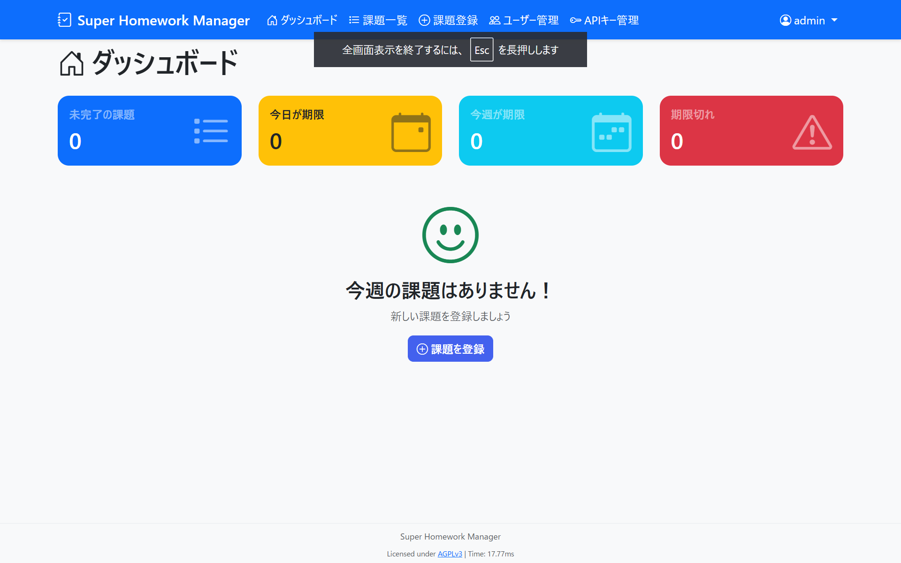
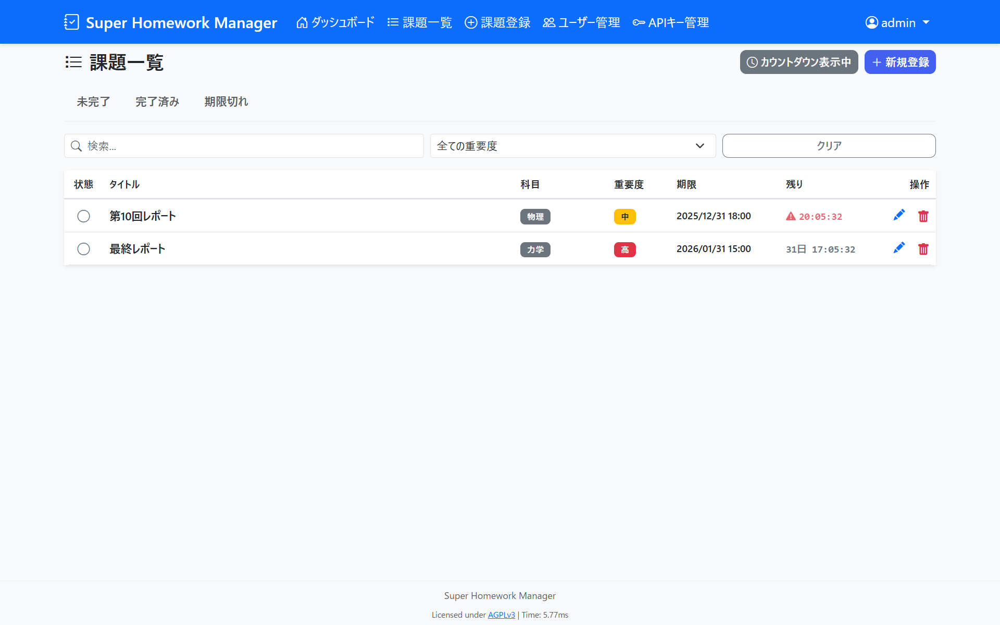
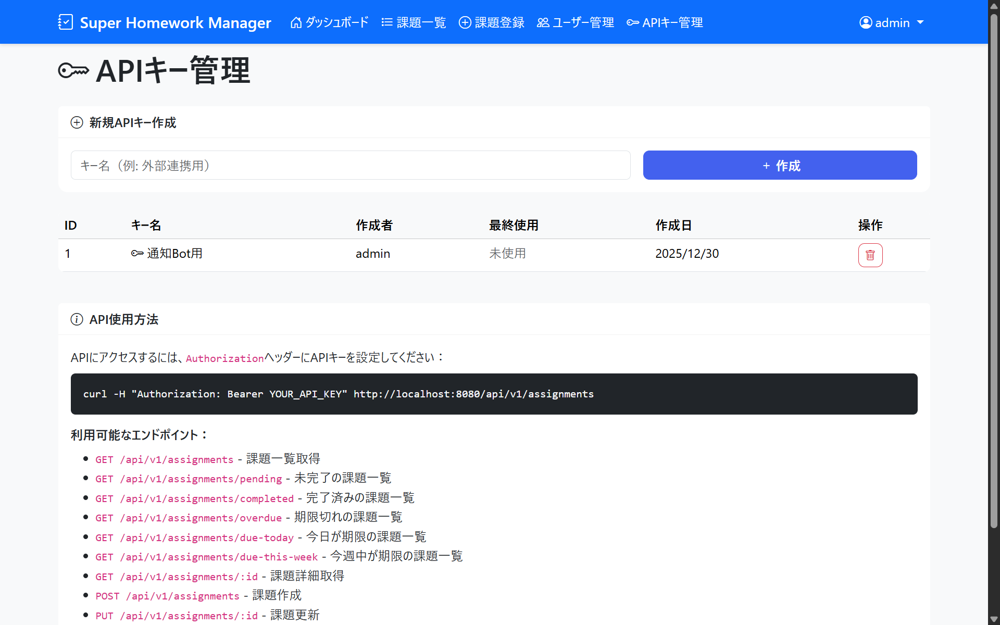

<div align="center">

# Super Homework Manager

シンプルで高機能な課題管理アプリケーション

[](https://go.dev/)
[](LICENSE.md)
[](#docker-での実行)

</div>

---

## 概要

学生の課題管理を効率化するために設計されたWebアプリケーションです。
繰り返し課題の自動生成やダッシュボードによる期限管理など、日々の課題管理をサポートします。

## スクリーンショット

| ダッシュボード | 課題一覧 | API |
|:---:|:---:|:---:|
|  |  |  |

## 特徴

| 機能 | 説明 |
|---|---|
| **課題管理** | 課題の登録・編集・削除・完了状況の管理 |
| **繰り返し課題** | 日次・週次・月次の繰り返し課題を自動生成 |
| **ダッシュボード** | 期限切れ・本日期限・今週期限の課題をひと目で確認 |
| **REST API** | 外部連携用のAPIキー認証付きRESTful API |
| **セキュリティ** | CSRF対策 / レート制限 / セキュアなセッション管理 / 2FA対応 |
| **ポータビリティ** | Pure Go SQLiteドライバー使用でCGO不要 |

## クイックスタート

### 前提条件

- **Go 1.24 以上** (ローカルビルドの場合)
- **Docker / Docker Compose** (コンテナ実行の場合)

### ローカルで実行

```bash
# 1. リポジトリのクローン
git clone <repository-url>
cd Homework-Manager

# 2. 依存関係のダウンロード
go mod download

# 3. ビルド
go build -o homework-manager cmd/server/main.go

# 4. 設定ファイルの準備
cp config.ini.example config.ini

# 5. 実行
./homework-manager
```

> **Windows (PowerShell)** の場合:
> `Copy-Item config.ini.example config.ini` → `.\homework-manager.exe`

ブラウザで **http://localhost:8080** にアクセスしてください。

### Docker での実行

```bash
# 1. 設定ファイルの準備 (必須 ※これを行わないとDockerがディレクトリとして作成し起動に失敗します)
cp config.ini.example config.ini

# 2. コンテナの起動
docker-compose up -d --build
```

ブラウザで **http://localhost:8080** にアクセスしてください。

> **注意**: 本番環境で使用する場合は、`config.ini` の `[session] secret` と `[security] csrf_secret` を必ず変更してください。

## 更新方法

```bash
git pull
go build -o homework-manager cmd/server/main.go
# アプリケーションを再起動
```

## ドキュメント

| ドキュメント | 内容 |
|---|---|
| [仕様書](docs/SPECIFICATION.md) | 機能詳細・データモデル・設定項目 |
| [APIドキュメント](docs/API.md) | エンドポイント・リクエスト/レスポンス形式 |

## TODO

- [ ] 取り組み目安時間の登録
- [ ] SNS連携

## ライセンス

[AGPLv3 (GNU Affero General Public License v3)](LICENSE.md)
